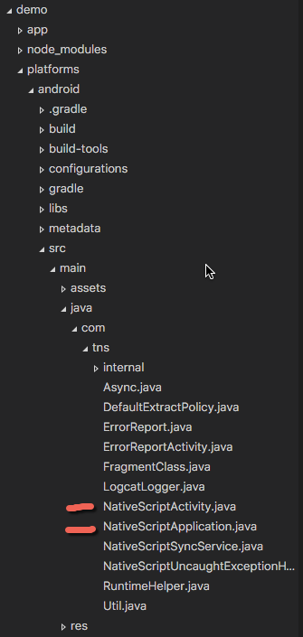

# Auth0 Social Authentication Plugin for NativeScript

[Auth0: Identity made simple for developers](https://auth0.com)

## Setup
``` terminal
tns plugin add nativescript-auth0
```

- Login to your auth0 account, get your domain\clientid info
- Setup the allowed providers, what you pick here is what AUTOMATICALLY shows up on the login box (so cool and easy)
- Make sure you have an allowed callback url per the [docs](https://auth0.com/docs/quickstart/native-mobile/ios-objc/aspnet-webapi#before-starting)

#### Android: App_Resources/Android/AndroidManifest.xml
``` xml
	<!--Auth0 Lock-->
	<activity
	android:name="com.auth0.lock.LockActivity"
	android:theme="@style/Lock.Theme"
	android:screenOrientation="portrait"
	android:launchMode="singleTask">
	<intent-filter>
		<action android:name="android.intent.action.VIEW"/>
		<category android:name="android.intent.category.DEFAULT"/>
		<category android:name="android.intent.category.BROWSABLE"/>
		<!-- 1) Keep the a0 at the start-->
        <!-- 2) CLIENTID SCHEME MUST BE LOWERCASE, JUST HERE !!! -->
		<data android:scheme="a0CLIENTID-GOES-HERE" android:host="DOMAIN-GOES-HERE"/>
	</intent-filter>
	</activity>
	<meta-data android:name="com.auth0.lock.client-id" android:value="CLIENTID-GOES-HERE"/> <!-- ClientID here should be as you see it in your auth0 dash -->
	<meta-data android:name="com.auth0.lock.domain-url" android:value="DOMAIN-GOES-HERE"/>
	<!--Auth0 Lock End-->
```

#### iOS: App_Resources/iOS/Info.plist 
``` xml
<key>Auth0Domain</key>
    <string>DOMAIN-GOES-HERE</string>
    <key>Auth0ClientId</key>
    <string>CLIENTID-GOES-HERE</string>
    <key>CFBundleURLTypes</key>
    <array>
        <dict>
            <key>CFBundleTypeRole</key>
            <string>None</string>
            <key>CFBundleURLName</key>
            <string>auth0</string>
            <key>CFBundleURLSchemes</key>
            <array>
                <string>a0CLIENTID-GOES-HERE</string>
            </array>
        </dict>
    </array>
```

## Configuration/Initalization 

## app.js 
``` js
if (application.ios) {
    var __extends = this.__extends || function (d, b) {
        for (var p in b) if (b.hasOwnProperty(p)) d[p] = b[p];
        function __() { this.constructor = d; }
        __.prototype = b.prototype;
        d.prototype = new __();
    };
    
    var appDelegate = (function (_super) {
        __extends(appDelegate, _super);
        function appDelegate() {
            _super.apply(this, arguments);
        }
        
        appDelegate.prototype.applicationDidFinishLaunchingWithOptions = function (application, launchOptions) {
            auth0.initalize();
        };
        
        appDelegate.ObjCProtocols = [UIApplicationDelegate];
        return appDelegate;
    })(UIResponder);
    application.ios.delegate = appDelegate;
}else{
    //Android
    auth0.initalize();
}

//Application.start goes somewhere below here
```

## Android: Just overwrite files 
* Open node_modules/platforms/android
* Copy the NativeScriptApplication.java file
* Overwrite the exisiting file
* 
* **NOTE:** platforms is a volitle folder, you'll need to re-copy these files on every platform remove/add android command.  {N} is working on a way to improve this process.

## How to use 
``` js
var auth0 = require("nativescript-auth0");
```

#### Login Option 1: Open native auth0 login UI (Called "Lock") 
``` js
//Doesn't seem to work on navigatedTo event, call on the loadedEvent
auth0.show().then(function(args){
		console.log(args.profile);
		console.log(args.token);
        appSettings.setString("UserData", JSON.stringify(args));
	});
```


#### Login Option 2: Open identity providers UI directly 
##### Sends you right to googles auth screen, returning the result 

``` js
var connectionName = "my-auth0-connection"; //Connection name from the auth0 backend
auth0.showIdp(connectionName).then(function(args){
		console.log(args.profile);
		console.log(args.token);
        appSettings.setString("UserData", JSON.stringify(args));
	});
```

[Complete Login Sample](https://github.com/sitefinitysteve/nativescript-auth0/blob/master/demo/app/login.js)

## Methods ##
* isTokenExpired(tokenid) * (Decodes and validates the exp date) *
* decodeToken(tokenid) * (Does not validate the token) *
* addParameter(key, value) [Doc](https://auth0.com/docs/libraries/lock-ios/sending-authentication-parameters)
* addScopeParameter(scope) [Doc](https://auth0.com/docs/libraries/lock-ios/sending-authentication-parameters)


## Android

This won't work yet until {N} can support impliments on the application

[Auth0 Sample](https://auth0.com/docs/quickstart/native-mobile/android/aspnet-webapi#3-initialize-lock)

[Git Issue #283](https://github.com/NativeScript/android-runtime/issues/283)

## Styling

Auth0 lets you customize a lot about the widget, I've wrapped them into some helpers.  
* Pass the colors as Hex codes, convert to UIColor on iOS
* Image the name of the image which exists in your resources
```
// Examples
var imageName = "Icon";
var imageName = "Default";
```
* Fonts require a NativeScript font object
```
// Example
var fontModule = require("ui/styling/font");
var font = new fontModule.Font("Open Sans", 20, "normal", "normal");
auth0.themeTitle("#666666", font);
```
* Must call your theme BEFORE calling the .show method

```
auth0.themePrimaryButton(normalColor, highlightColor, textColor, font);
auth0.themeSecondaryButton(backgroundColor, textColor, font, normalImage, highlightedImage);
auth0.themeTextField(textColor, placeholderTextColor, iconColor, font);
auth0.themeTitle(textColor, font);
auth0.themeIcon(backgroundColor, imageName);
auth0.themeBackground(backgroundColor, imageName);
auth0.themeDescription(textColor, font);
auth0.themeSeperator(textColor, font);
auth0.themeCredentialBox(borderColor, separatorColor, backgroundColor);
auth0.themeCloseButton(tintColor);
```

## TODO
* Custom Login
* Token Helpers, store in Keychain

## Thanks to
* [jwt-decode](https://www.npmjs.com/package/jwt-decode) from Auth0